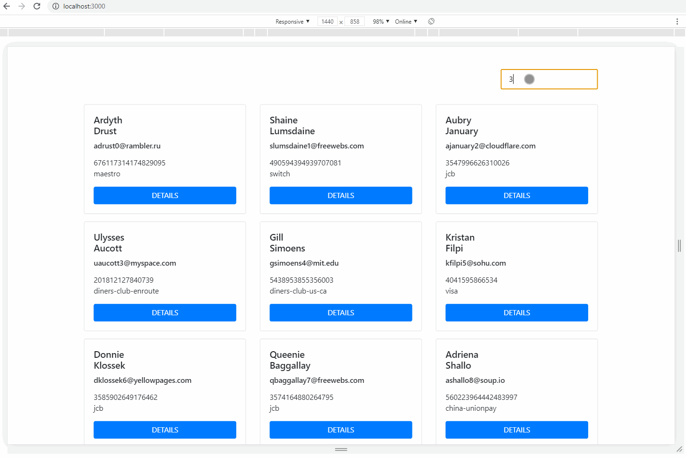

# Code Challenge

## Setting up environment

- Install Node 12.18.3
- Install Yarn `npm i -g yarn`
- Install dependencies `yarn install`
- Run the app `yarn start`

## Technologies

- ReactJS (Create React App)
- Funciton Components with Hooks
- Redux
- React-Router
- React-Bootstrap
- SCSS